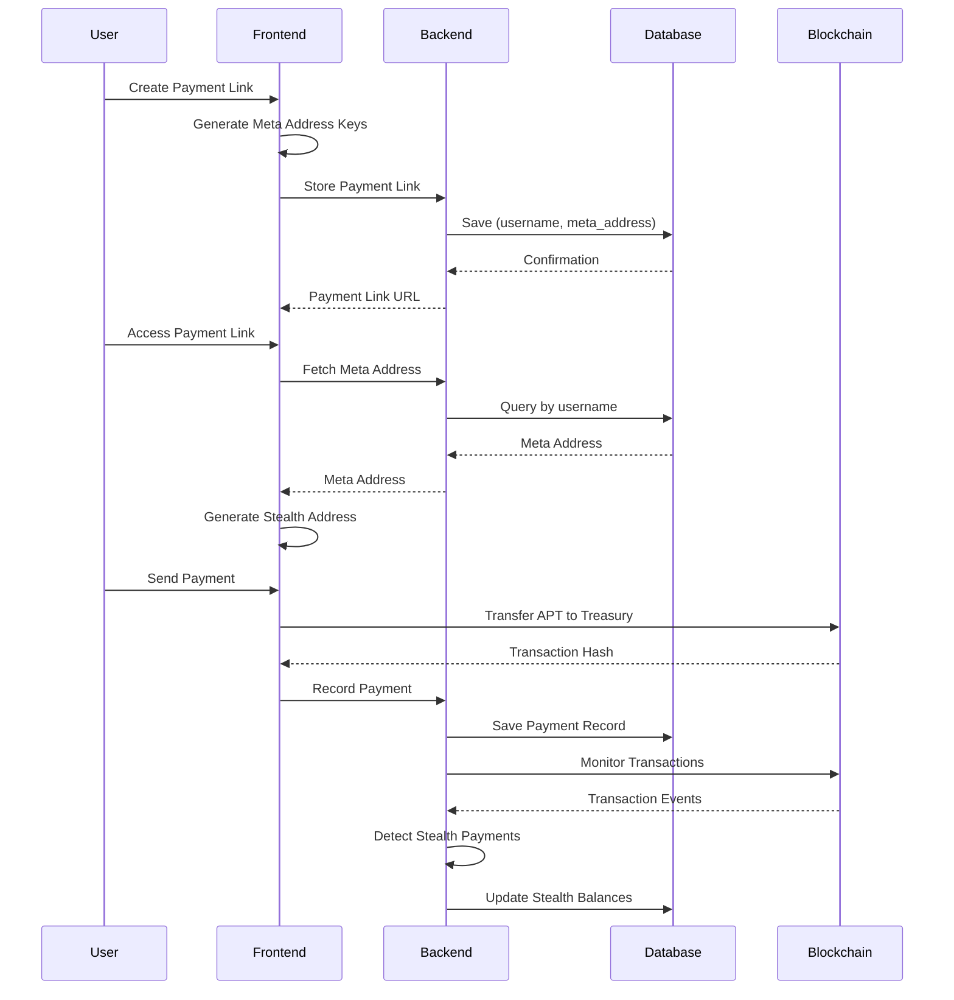

# Design Document - Stealth Payment System

## Overview

The Stealth Payment System is a privacy-preserving payment platform built on Aptos blockchain that implements stealth addresses to enable completely untraceable transactions. The system uses elliptic curve cryptography (secp256k1), ECDH key exchange, and cryptographic hashing to generate unique one-time addresses for each payment. This design ensures sender privacy, receiver privacy, and observer blindness while maintaining the ability for recipients to detect and spend their funds.

The architecture follows a client-side cryptographic approach where all sensitive key operations happen in the user's browser, with a backend service handling payment link management, transaction monitoring, and database operations.

## Architecture

### High-Level System Architecture

```
┌─────────────────────────────────────────────────────────────┐
│                        Frontend (React)                      │
│  ┌────────────────┐  ┌──────────────┐  ┌─────────────────┐ │
│  │ Crypto Library │  │  UI Components│  │  State Management│ │
│  │  (secp256k1)   │  │  (NextUI)     │  │    (Jotai)      │ │
│  └────────────────┘  └──────────────┘  └─────────────────┘ │
└───────────────────────────┬─────────────────────────────────┘
                            │
                            ▼
┌─────────────────────────────────────────────────────────────┐
│                    Backend API (Node.js)                     │
│  ┌────────────────┐  ┌──────────────┐  ┌─────────────────┐ │
│  │ Payment Links  │  │  Monitoring   │  │  User Management│ │
│  │   Service      │  │   Workers     │  │     Service     │ │
│  └────────────────┘  └──────────────┘  └─────────────────┘ │
└───────────────────────────┬─────────────────────────────────┘
                            │
                            ▼
┌─────────────────────────────────────────────────────────────┐
│                   Supabase (PostgreSQL)                      │
│  ┌────────────────┐  ┌──────────────┐  ┌─────────────────┐ │
│  │     Users      │  │ Payment Links│  │ Stealth Addresses│ │
│  └────────────────┘  └──────────────┘  └─────────────────┘ │
└─────────────────────────────────────────────────────────────┘
                            │
                            ▼
┌─────────────────────────────────────────────────────────────┐
│                    Aptos Blockchain                          │
│  ┌────────────────┐  ┌──────────────┐  ┌─────────────────┐ │
│  │ Move Contracts │  │  Transaction  │  │   Event System  │ │
│  │ (StealthSigner)│  │    Pool       │  │                 │ │
│  └────────────────┘  └──────────────┘  └─────────────────┘ │
└─────────────────────────────────────────────────────────────┘
```

### Component Interaction Flow



## Components and Interfaces

### 1. Cryptographic Module (`stealthAddress.js`)

**Responsibilities:**
- Generate secure random private keys
- Perform elliptic curve operations (secp256k1)
- Compute ECDH shared secrets
- Generate and validate stealth addresses
- Derive Aptos addresses from public keys

**Key Functions:**

```javascript
// Generate a random 32-byte private key
generatePrivateKey(): Uint8Array

// Get compressed public key (33 bytes) from private key
getPublicKey(privateKey: Uint8Array): Uint8Array

// Compute ECDH shared secret
computeSharedSecret(privateKey: Uint8Array, publicKey: Uint8Array): Uint8Array

// Generate stealth address from meta address
generateStealthAddress(
  spendPubKeyHex: string,
  viewingPubKeyHex: string,
  ephemeralPrivKey: Uint8Array,
  k: number
): {
  stealthAddress: string,
  ephemeralPubKey: string,
  viewHint: string,
  k: number
}

// Generate meta address key pairs
generateMetaAddressKeys(): {
  spend: { privateKey: string, publicKey: string },
  viewing: { privateKey: string, publicKey: string }
}

// Validate public key format
validatePublicKey(pubKeyHex: string): { valid: boolean, error?: string }
```

### 2. Payment Component (`Payment.jsx`)

**Responsibilities:**
- Display payment interface for payers
- Handle wallet connection
- Process payment transactions
- Track payment events for rewards

**Props:**
- `alias_url`: Payment link alias from URL params

**State:**
- `paymentLinkData`: Payment link information from database
- `recipientData`: Recipient user information
- `amount`: Payment amount in APT
- `isSending`: Transaction submission status

**Key Methods:**

```javascript
handleConnectWallet(): Promise<void>
handleSendPayment(): Promise<void>
```

### 3. Transfer Component (`Transfer.jsx`)

**Responsibilities:**
- Manage fund withdrawals from stealth addresses
- Handle same-chain and cross-chain transfers
- Compute stealth private keys for signing
- Batch multiple withdrawal transactions

**State:**
- `selectedToken`: Token to transfer
- `selectedChain`: Destination chain
- `amount`: Transfer amount
- `destination`: Destination address
- `withdrawQueue`: Array of stealth addresses to withdraw from

**Key Methods:**

```javascript
handleTransfer(): Promise<void>
getFilteredChains(): Chain[]
```

### 4. Supabase Service (`supabase.js`)

**Responsibilities:**
- Manage database operations
- Store and retrieve payment links
- Record payment transactions
- Query stealth address balances

**Key Functions:**

```javascript
getPaymentLinkByAlias(alias: string): Promise<PaymentLink>
getUserByUsername(username: string): Promise<User>
recordPayment(sender: string, recipient: string, amount: number, txHash: string): Promise<void>
```

### 5. Aptos Service (`aptos.js`)

**Responsibilities:**
- Interact with Aptos blockchain
- Send APT transfers
- Query account balances
- Monitor transaction confirmations

**Key Functions:**

```javascript
sendAptTransfer({
  accountAddress: string,
  recipientAddress: string,
  amount: number,
  isTestnet: boolean
}): Promise<{ success: boolean, hash: string, explorerUrl: string }>
```

### 6. cBridge Service (`cBridge.js`)

**Responsibilities:**
- Handle cross-chain transfers
- Compute bridge fees and slippage
- Submit bridge transactions
- Track bridge transfer status

**Key Functions:**

```javascript
poolTransfer({
  cBridgeBaseUrl: string,
  receiverAddress: string,
  signer: Wallet,
  srcChainId: number,
  dstChainId: number,
  tokenSymbol: string,
  amount: number,
  slippageTolerance: number
}): Promise<{ transactionId: string }>
```

## Data Models

### User

```typescript
interface User {
  id: string;
  username: string;
  wallet_address: string;
  meta_address: {
    spend_public_key: string;
    viewing_public_key: string;
  };
  created_at: timestamp;
  updated_at: timestamp;
}
```

### Payment Link

```typescript
interface PaymentLink {
  id: string;
  user_id: string;
  username: string;
  alias: string;
  meta_address: {
    spend_public_key: string;
    viewing_public_key: string;
  };
  created_at: timestamp;
  is_active: boolean;
}
```

### Stealth Address

```typescript
interface StealthAddress {
  id: string;
  user_id: string;
  address: string;
  ephemeral_public_key: string;
  view_hint: string;
  k_index: number;
  chain_id: number;
  token_address: string | null; // null for native token
  balance: string; // stored as string to preserve precision
  is_withdrawn: boolean;
  created_at: timestamp;
  withdrawn_at: timestamp | null;
}
```

### Payment Transaction

```typescript
interface PaymentTransaction {
  id: string;
  sender_address: string;
  recipient_username: string;
  amount: number;
  token_symbol: string;
  chain_id: number;
  tx_hash: string;
  status: 'pending' | 'confirmed' | 'failed';
  created_at: timestamp;
  confirmed_at: timestamp | null;
}
```

### Meta Address Keys (Local Storage)

```typescript
interface MetaAddressKeys {
  spend: {
    privateKey: string; // hex encoded
    publicKey: string;  // hex encoded, 33 bytes compressed
  };
  viewing: {
    privateKey: string; // hex encoded
    publicKey: string;  // hex encoded, 33 bytes compressed
  };
}
```

## Correctness Properties

*A property is a characteristic or behavior that should hold true across all valid executions of a system—essentially, a formal statement about what the system should do. Properties serve as the bridge between human-readable specifications and machine-verifiable correctness guarantees.*

### Property 1: Key Generation Validity
*For any* generated private key, the key must be 32 bytes, non-zero, and produce a valid compressed public key of 33 bytes with compression flag 0x02 or 0x03.
**Validates: Requirements 1.1, 1.2, 10.2**

### Property 2: Stealth Address Uniqueness
*For any* two stealth address generations with different ephemeral keys or different k indices, the resulting stealth addresses must be distinct.
**Validates: Requirements 2.1, 2.7**

### Property 3: Stealth Address Derivation Consistency
*For any* meta address and ephemeral key pair, generating a stealth address and then independently deriving it using the viewing private key must produce the same address.
**Validates: Requirements 2.2, 2.3, 2.4, 2.5, 5.3**

### Property 4: ECDH Shared Secret Symmetry
*For any* two key pairs (A, B), computing ECDH(privA, pubB) must equal ECDH(privB, pubA).
**Validates: Requirements 2.2, 10.6**

### Property 5: Stealth Private Key Correctness
*For any* stealth address generated with spend public key and tweak, the derived stealth private key (spend_priv + tweak) must correspond to the stealth public key (spend_pub + tweak*G).
**Validates: Requirements 6.4**

### Property 6: Payment Link Uniqueness
*For any* two payment links, their usernames must be distinct across the platform.
**Validates: Requirements 3.1**

### Property 7: Payment Amount Validation
*For any* payment transaction, the amount must be greater than zero and less than or equal to the sender's balance.
**Validates: Requirements 4.3**

### Property 8: Withdrawal Queue Completeness
*For any* withdrawal request with amount A and available stealth addresses with total balance B where B >= A, the withdrawal queue must select addresses such that the sum of selected amounts equals A.
**Validates: Requirements 6.3**

### Property 9: Transaction Hash Uniqueness
*For any* two confirmed transactions on the blockchain, their transaction hashes must be distinct.
**Validates: Requirements 4.7**

### Property 10: Public Key Validation
*For any* public key string, validation must reject keys that are not 33 bytes or do not have compression flag 0x02 or 0x03.
**Validates: Requirements 1.5, 10.5**

### Property 11: Balance Aggregation Consistency
*For any* set of stealth addresses for a user, token, and chain, the aggregated balance must equal the sum of individual stealth address balances.
**Validates: Requirements 5.5, 9.2**

### Property 12: Cross-Chain Route Validation
*For any* token and destination chain selection, the system must only allow transfers if a valid bridge route exists in the cBridge configuration.
**Validates: Requirements 7.1**

### Property 13: Gas Fee Coverage
*For any* withdrawal transaction, the stealth address balance must be greater than or equal to the sum of transfer amount and estimated gas fees.
**Validates: Requirements 6.6**

### Property 14: Retry Logic Bounds
*For any* network operation with retry logic, the number of retry attempts must not exceed 3 with exponential backoff.
**Validates: Requirements 5.6, 11.3**

### Property 15: Encryption Before Storage
*For any* private key stored in local storage, it must be encrypted before storage and decrypted only when needed for signing.
**Validates: Requirements 1.4, 10.4**

## Error Handling

### Cryptographic Errors

1. **Invalid Key Format**
   - Validation: Check key length and format before operations
   - Recovery: Regenerate keys and prompt user to retry
   - User Message: "Invalid key format. Please try again."

2. **ECDH Computation Failure**
   - Validation: Verify public key is on curve before multiplication
   - Recovery: Log error details and use fallback ephemeral key
   - User Message: "Failed to generate secure address. Retrying..."

3. **Address Derivation Failure**
   - Validation: Ensure all inputs are valid before hashing
   - Recovery: Regenerate ephemeral key and retry
   - User Message: "Address generation failed. Please refresh and try again."

### Transaction Errors

1. **Insufficient Balance**
   - Detection: Check balance before transaction submission
   - Recovery: Display required amount and current balance
   - User Message: "Insufficient balance. You need X APT but have Y APT."

2. **Transaction Rejection**
   - Detection: Catch wallet rejection errors
   - Recovery: Allow user to retry or cancel
   - User Message: "Transaction was rejected. Please try again."

3. **Network Timeout**
   - Detection: Set timeout on RPC calls (30 seconds)
   - Recovery: Retry up to 3 times with exponential backoff
   - User Message: "Network timeout. Retrying... (Attempt X/3)"

4. **Gas Estimation Failure**
   - Detection: Catch gas estimation errors
   - Recovery: Use default gas limit with 20% buffer
   - User Message: "Using default gas limit. Transaction may cost more."

### Database Errors

1. **Payment Link Not Found**
   - Detection: Check query result for null
   - Recovery: Suggest checking URL or creating new link
   - User Message: "Payment link not found. Please check the URL."

2. **Duplicate Username**
   - Detection: Check for unique constraint violation
   - Recovery: Prompt user to choose different username
   - User Message: "Username already taken. Please choose another."

3. **Connection Failure**
   - Detection: Catch Supabase connection errors
   - Recovery: Retry with exponential backoff up to 3 times
   - User Message: "Database connection failed. Retrying..."

### Wallet Errors

1. **Wallet Not Installed**
   - Detection: Check for window.aptos object
   - Recovery: Display installation instructions
   - User Message: "Petra wallet not detected. Please install from Chrome Web Store."

2. **Wallet Connection Rejected**
   - Detection: Catch connection rejection
   - Recovery: Allow user to retry connection
   - User Message: "Wallet connection rejected. Please try again."

3. **Wrong Network**
   - Detection: Check connected network ID
   - Recovery: Prompt user to switch network
   - User Message: "Please switch to Aptos Testnet in your wallet."

## Testing Strategy

### Unit Testing

**Framework:** Vitest (configured in Vite project)

**Test Coverage:**

1. **Cryptographic Functions**
   - Test key generation produces valid 32-byte keys
   - Test public key derivation produces 33-byte compressed keys
   - Test ECDH shared secret computation
   - Test stealth address generation with known inputs
   - Test address derivation matches expected Aptos format
   - Test public key validation rejects invalid formats

2. **Component Logic**
   - Test payment amount validation
   - Test withdrawal queue construction
   - Test balance aggregation
   - Test chain filtering based on token selection
   - Test error message display

3. **Utility Functions**
   - Test hex to bytes conversion
   - Test bytes to hex conversion
   - Test currency formatting
   - Test address truncation

### Property-Based Testing

**Framework:** fast-check (JavaScript property-based testing library)

**Configuration:** Each property test should run a minimum of 100 iterations to ensure comprehensive coverage of the input space.

**Test Tagging:** Each property-based test must include a comment explicitly referencing the correctness property from the design document using this format:
```javascript
// **Feature: stealth-payment-system, Property 1: Key Generation Validity**
```

**Property Tests:**

1. **Property 1: Key Generation Validity**
   ```javascript
   // **Feature: stealth-payment-system, Property 1: Key Generation Validity**
   fc.assert(
     fc.property(fc.constant(null), () => {
       const privKey = generatePrivateKey();
       expect(privKey.length).toBe(32);
       expect(privKey.some(byte => byte !== 0)).toBe(true);
       const pubKey = getPublicKey(privKey);
       expect(pubKey.length).toBe(33);
       expect([0x02, 0x03]).toContain(pubKey[0]);
     }),
     { numRuns: 100 }
   );
   ```

2. **Property 2: Stealth Address Uniqueness**
   ```javascript
   // **Feature: stealth-payment-system, Property 2: Stealth Address Uniqueness**
   fc.assert(
     fc.property(
       fc.hexaString({ minLength: 66, maxLength: 66 }),
       fc.hexaString({ minLength: 66, maxLength: 66 }),
       fc.integer({ min: 0, max: 1000 }),
       (spendPub, viewingPub, k) => {
         const eph1 = generatePrivateKey();
         const eph2 = generatePrivateKey();
         const addr1 = generateStealthAddress(spendPub, viewingPub, eph1, k);
         const addr2 = generateStealthAddress(spendPub, viewingPub, eph2, k);
         expect(addr1.stealthAddress).not.toBe(addr2.stealthAddress);
       }
     ),
     { numRuns: 100 }
   );
   ```

3. **Property 4: ECDH Shared Secret Symmetry**
   ```javascript
   // **Feature: stealth-payment-system, Property 4: ECDH Shared Secret Symmetry**
   fc.assert(
     fc.property(fc.constant(null), () => {
       const privA = generatePrivateKey();
       const pubA = getPublicKey(privA);
       const privB = generatePrivateKey();
       const pubB = getPublicKey(privB);
       
       const secretAB = computeSharedSecret(privA, pubB);
       const secretBA = computeSharedSecret(privB, pubA);
       
       expect(bytesToHex(secretAB)).toBe(bytesToHex(secretBA));
     }),
     { numRuns: 100 }
   );
   ```

4. **Property 7: Payment Amount Validation**
   ```javascript
   // **Feature: stealth-payment-system, Property 7: Payment Amount Validation**
   fc.assert(
     fc.property(
       fc.double({ min: -1000, max: 1000 }),
       fc.double({ min: 0, max: 1000 }),
       (amount, balance) => {
         const isValid = amount > 0 && amount <= balance;
         const validationResult = validatePaymentAmount(amount, balance);
         expect(validationResult.valid).toBe(isValid);
       }
     ),
     { numRuns: 100 }
   );
   ```

5. **Property 10: Public Key Validation**
   ```javascript
   // **Feature: stealth-payment-system, Property 10: Public Key Validation**
   fc.assert(
     fc.property(
       fc.hexaString({ minLength: 1, maxLength: 100 }),
       (hexString) => {
         const result = validatePublicKey(hexString);
         if (hexString.length === 66 && (hexString.startsWith('02') || hexString.startsWith('03'))) {
           expect(result.valid).toBe(true);
         } else {
           expect(result.valid).toBe(false);
           expect(result.error).toBeDefined();
         }
       }
     ),
     { numRuns: 100 }
   );
   ```

6. **Property 11: Balance Aggregation Consistency**
   ```javascript
   // **Feature: stealth-payment-system, Property 11: Balance Aggregation Consistency**
   fc.assert(
     fc.property(
       fc.array(fc.record({
         address: fc.hexaString({ minLength: 64, maxLength: 64 }),
         balance: fc.double({ min: 0, max: 1000 }),
         chainId: fc.constant(1),
         tokenAddress: fc.constant('0x123')
       })),
       (stealthAddresses) => {
         const aggregated = aggregateAssets(stealthAddresses, {
           chainId: 1,
           tokenAddress: '0x123'
         });
         const expectedSum = stealthAddresses.reduce((sum, addr) => sum + addr.balance, 0);
         expect(aggregated.balance).toBeCloseTo(expectedSum, 8);
       }
     ),
     { numRuns: 100 }
   );
   ```

### Integration Testing

1. **End-to-End Payment Flow**
   - Create payment link
   - Generate stealth address
   - Send payment to treasury
   - Verify payment recorded in database
   - Verify balance updated in UI

2. **Withdrawal Flow**
   - Create multiple stealth addresses with balances
   - Initiate withdrawal
   - Verify stealth private keys computed correctly
   - Verify transactions submitted to blockchain
   - Verify balances updated after withdrawal

3. **Cross-Chain Transfer Flow**
   - Select token and destination chain
   - Verify bridge route validation
   - Submit bridge transfer
   - Monitor transfer status
   - Verify balance on destination chain

### Manual Testing Checklist

- [ ] Wallet connection with Petra
- [ ] Payment link creation with various usernames
- [ ] Payment submission with different amounts
- [ ] Withdrawal from single stealth address
- [ ] Withdrawal from multiple stealth addresses
- [ ] Cross-chain transfer via cBridge
- [ ] Error handling for insufficient balance
- [ ] Error handling for network failures
- [ ] UI responsiveness on mobile devices
- [ ] Transaction confirmation in blockchain explorer

## Security Considerations

1. **Private Key Storage**
   - Store encrypted in local storage
   - Never transmit to backend
   - Clear on logout

2. **Shared Secret Computation**
   - Validate public keys before ECDH
   - Use constant-time operations where possible
   - Clear sensitive data from memory after use

3. **Transaction Signing**
   - Verify transaction data before signing
   - Display transaction details to user
   - Implement transaction limits for safety

4. **API Security**
   - Use HTTPS for all communications
   - Implement rate limiting on backend
   - Validate all user inputs

5. **Database Security**
   - Use parameterized queries
   - Implement row-level security in Supabase
   - Encrypt sensitive fields at rest

## Performance Considerations

1. **Cryptographic Operations**
   - Cache public keys to avoid recomputation
   - Use Web Workers for heavy computations
   - Batch stealth address generation when possible

2. **Database Queries**
   - Index frequently queried fields (username, address)
   - Use pagination for transaction history
   - Implement caching for payment link lookups

3. **Blockchain Interactions**
   - Batch transaction submissions
   - Use WebSocket for real-time updates
   - Implement exponential backoff for retries

4. **UI Rendering**
   - Lazy load components
   - Virtualize long lists
   - Optimize re-renders with React.memo

## Future Enhancements

1. **Zero-Knowledge Proofs**
   - Implement Plonky2 for transaction privacy
   - Use Bulletproofs for amount hiding
   - Enable private balance proofs

2. **DarkPool Mixer**
   - Integrate ROFL for off-chain mixing
   - Implement ring signatures
   - Add RingCT for confidential transactions

3. **Multi-Chain Support**
   - Expand to Ethereum, BSC, Polygon
   - Implement universal stealth address format
   - Support cross-chain payment links

4. **Advanced Features**
   - Recurring payments
   - Payment requests
   - Multi-signature stealth addresses
   - Time-locked payments
