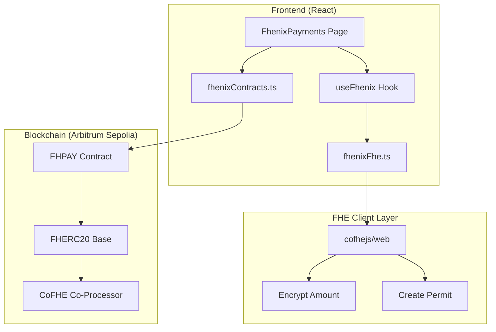
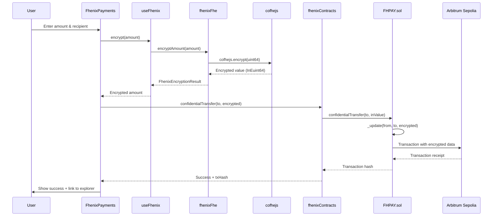
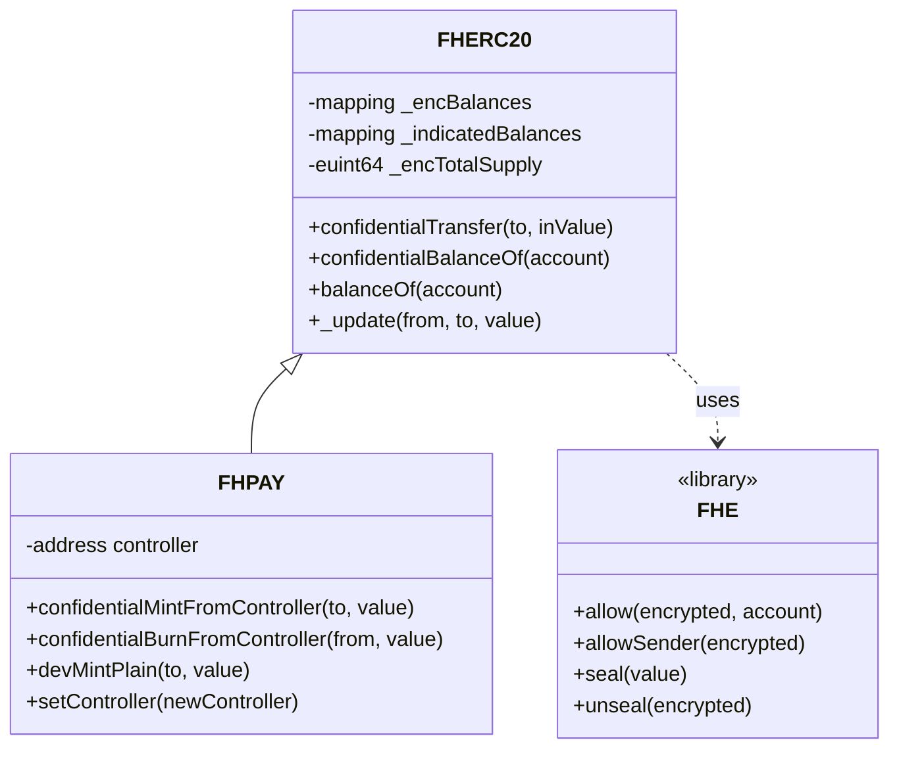
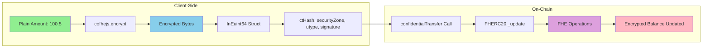
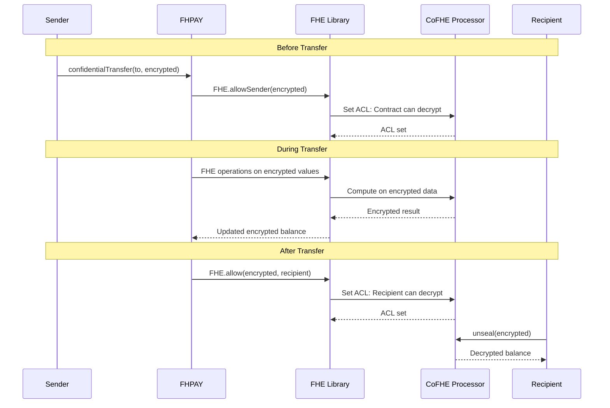
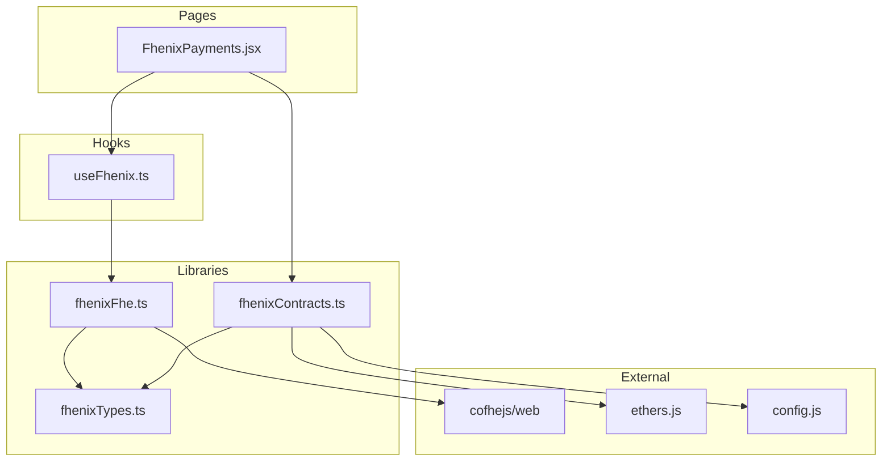
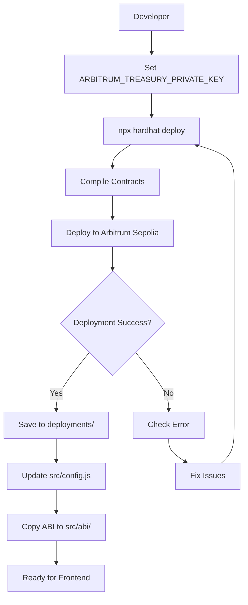
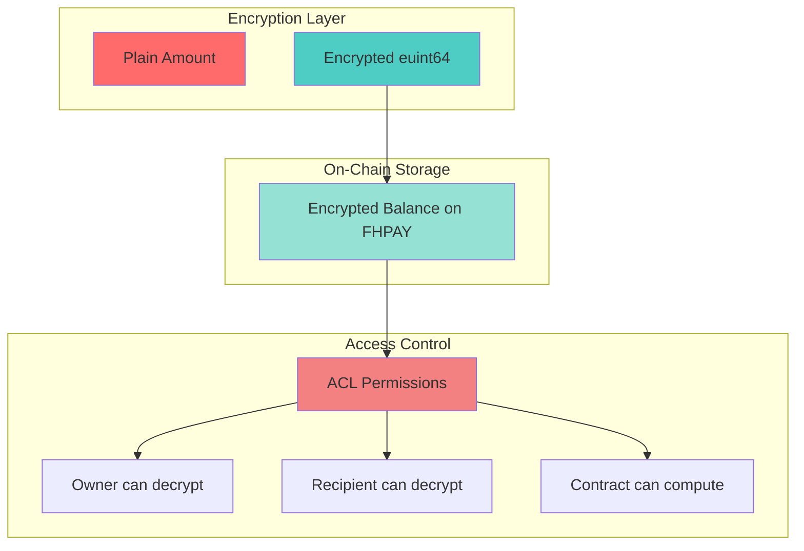
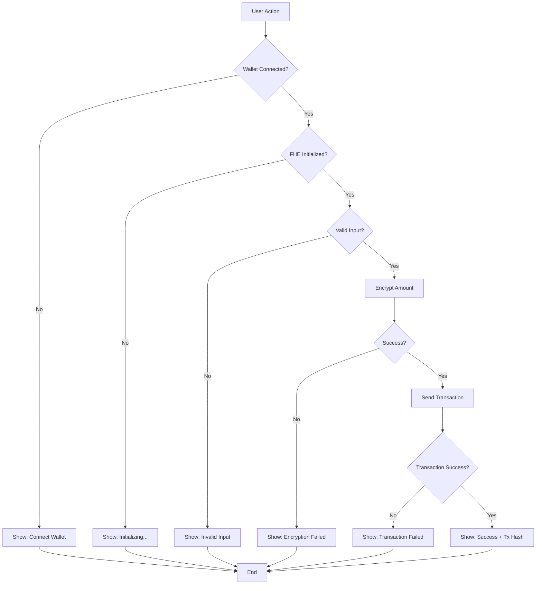

# Fhenix Integration Architecture

This document describes the Fhenix integration architecture for Private-Pay, based on the `zec2eth` repository pattern.

## System Overview

## Confidential Transfer Flow

## Contract Architecture

## Data Flow: Encryption to On-Chain

## Access Control List (ACL) Flow

## Frontend Component Structure

## Deployment Flow

## Security Model

## Error Handling Flow

## Integration Checklist

- [x] Smart contracts (FHERC20, FHPAY)
- [x] Hardhat configuration
- [x] Deployment scripts
- [x] Contract deployment to Arbitrum Sepolia
- [x] Frontend FHE client (fhenixFhe.ts)
- [x] React hook (useFhenix.ts)
- [x] Contract helpers (fhenixContracts.ts)
- [x] UI page (FhenixPayments.jsx)
- [x] Router integration
- [ ] E2E testing
- [ ] Documentation updates
- [ ] Production deployment

## Next Steps

1. **Testing:**
   - Unit tests for contracts
   - Integration tests for frontend
   - E2E manual testing on Arbitrum Sepolia

2. **Enhancements:**
   - Batch transfers
   - Multi-recipient payments
   - Payment links with FHE
   - Balance history (encrypted)

3. **Production:**
   - Deploy to Arbitrum Mainnet
   - Security audit
   - Gas optimization
   - User documentation

