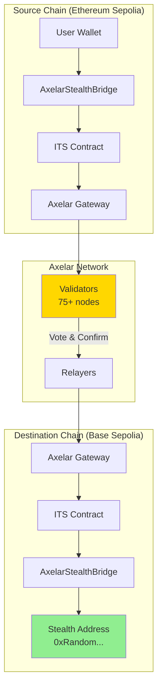
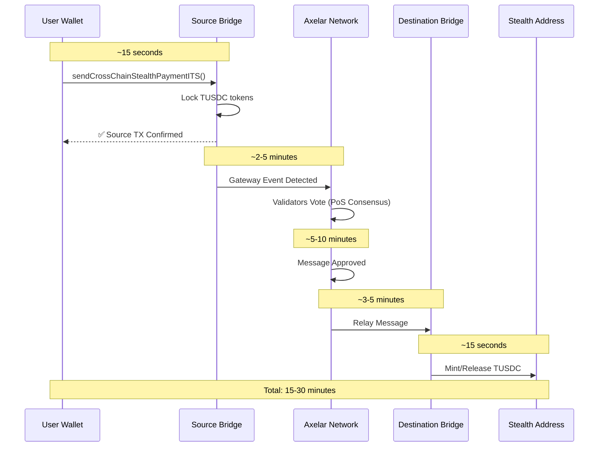
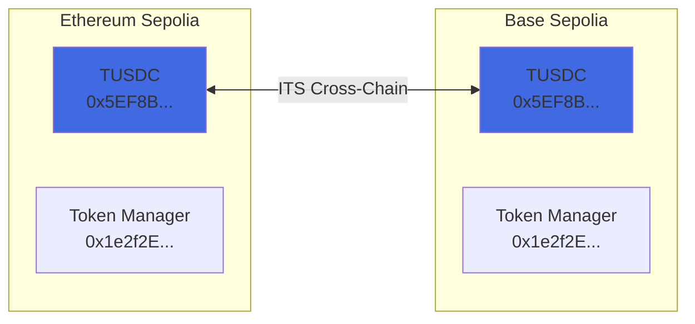
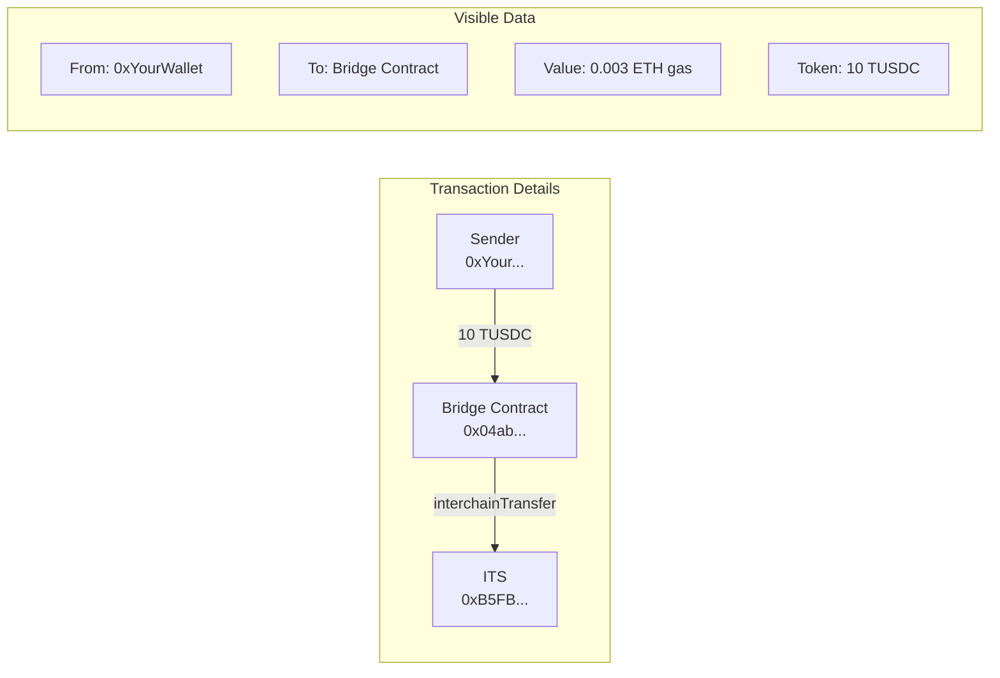
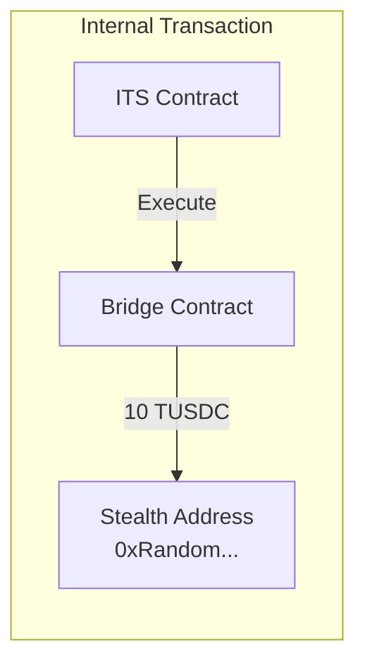
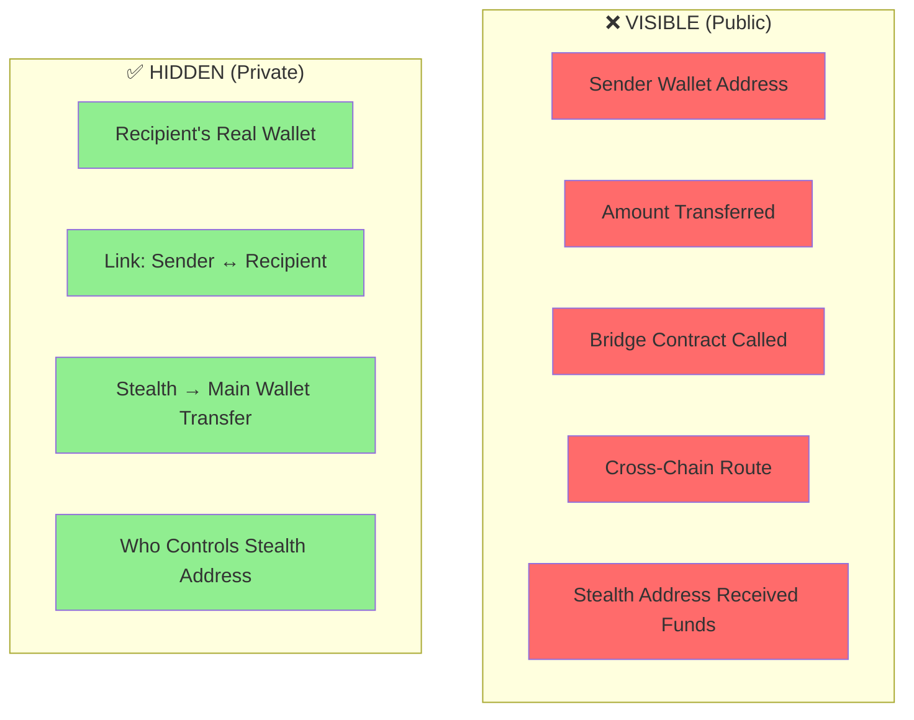
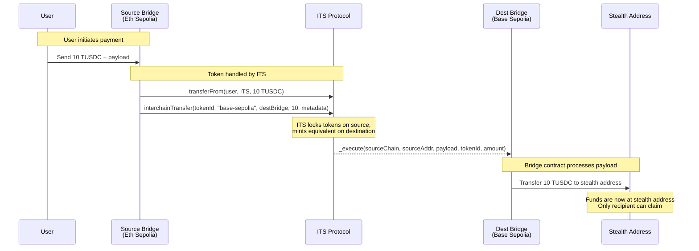
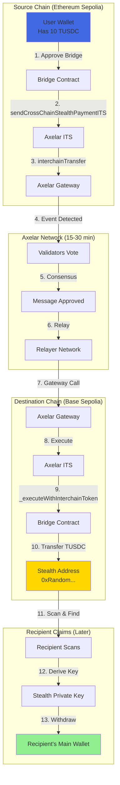

# Cross-Chain Stealth Payment Flow

## Overview

PrivatePay uses Axelar's Interchain Token Service (ITS) to enable cross-chain stealth payments. This document explains the complete flow.

---

## 🏗️ System Architecture



---

## ⏱️ Why Does It Take 15-30 Minutes?



### Breakdown

| Step | Duration | What Happens |
|------|----------|--------------|
| Source Chain Confirmation | ~15 sec | Transaction confirmed on Ethereum Sepolia |
| Axelar Detection | 2-5 min | Validators detect gateway event |
| Validator Voting | 5-10 min | 75+ validators reach consensus |
| Message Approval | 3-5 min | Message approved on Axelar network |
| Relay to Destination | 3-5 min | Relayers submit to Base Sepolia |
| Destination Execution | ~15 sec | TUSDC minted to stealth address |

**Total: 15-30 minutes** (Standard GMP)

> 💡 **Express Mode** can reduce this to ~30 seconds but costs extra gas.

---

## 🪙 TUSDC Token Deployment

TUSDC is deployed via Axelar ITS (Interchain Token Service) using **CREATE3**, which gives it the **same address on all chains**.



### Token Addresses

| Network | TUSDC Address | Token Manager |
|---------|---------------|---------------|
| Ethereum Sepolia | `0x5EF8B232E6e5243bf9fAe7E725275A8B0800924B` | `0x1e2f2E68ea65212Ec6F3D91f39E6B644fE41e29B` |
| Base Sepolia | `0x5EF8B232E6e5243bf9fAe7E725275A8B0800924B` | `0x1e2f2E68ea65212Ec6F3D91f39E6B644fE41e29B` |

---

## 🔍 What Appears on Block Explorers?

### Source Chain (Etherscan Sepolia)



### Axelarscan (Cross-Chain Explorer)

```
┌─────────────────────────────────────────────────────────────┐
│                    Axelarscan GMP TX                        │
├─────────────────────────────────────────────────────────────┤
│ Source Chain:       ethereum-sepolia                        │
│ Destination Chain:  base-sepolia                            │
│ Status:             ✅ executed                             │
│ Type:               interchainTransfer                      │
│ Amount:             10 TUSDC                                │
│ Gas Paid:           0.003 ETH                               │
│ Time:               ~18 minutes                             │
└─────────────────────────────────────────────────────────────┘
```

### Destination Chain (BaseScan Sepolia)



---

## 🔒 Privacy Analysis: Is Source Identifiable?



### Privacy Summary

| Aspect | Level | Details |
|--------|-------|---------|
| **Sender Identity** | ❌ Visible | Sender's wallet is shown on source chain |
| **Recipient Identity** | ✅ Hidden | Only random stealth address visible |
| **Amount** | ❌ Visible | Transfer amount is public |
| **Sender-Recipient Link** | ✅ Hidden | No one can link sender to recipient's real wallet |
| **Withdrawal** | ✅ Private | Stealth → Main wallet link is unlinkable |

---

## 🏦 How Bridge Contracts Work (Not Treasury)

**Important Clarification:** We're NOT triggering a "treasury" on both chains. Here's what actually happens:



### Key Points:

1. **Bridge = Router, Not Treasury**
   - Bridge contracts don't hold funds long-term
   - They route tokens through ITS to stealth addresses

2. **ITS Handles Token Movement**
   - **Lock-Unlock** model (if token originated elsewhere)
   - **Mint-Burn** model (if native ITS token)

3. **Same Bridge Contract Different Chains**
   - Ethereum Sepolia: `0x04ab5fA40Df5bF1B5e9E640b5D24C740ec5DfDeE`
   - Base Sepolia: `0xE09f184968cdAD4D0B94e2968Cfbf1395FB66D79`

---

## 🔐 Stealth Address Cryptography

```mermaid
flowchart TB
    subgraph "Sender Side"
        E[Generate Random<br/>Ephemeral Key] --> SS1[Compute Shared Secret<br/>ephPriv × viewPub]
        SS1 --> T1[Tweak = SHA256<br/>sharedSecret || k]
        T1 --> SA[Stealth Address =<br/>spendPub + tweak × G]
    end
    
    subgraph "Receiver Side (Scanning)"
        VK[Viewing Private Key] --> SS2[Compute Shared Secret<br/>viewPriv × ephPub]
        SS2 --> VH[Check View Hint<br/>First byte of secret]
        VH -->|Match?| D[Derive Stealth Private Key<br/>spendPriv + tweak]
    end
    
    SA -.->|Funds sent here| VH
    
    style SA fill:#FFD700
    style D fill:#90EE90
```

---

## 📊 Complete Flow Diagram



---

## 🎥 Video Script Points

1. **Why 30 minutes?**
   - Axelar uses 75+ validators for security
   - Must wait for finality on source chain
   - Multi-step consensus process

2. **TUSDC Chains:**
   - Same address on Eth Sepolia & Base Sepolia
   - Deployed via ITS CREATE3

3. **Explorer visibility:**
   - Sender address is visible
   - Amount is visible
   - Stealth address is visible
   - BUT recipient's real identity is hidden

4. **Not a Treasury:**
   - Bridge routes tokens, doesn't store them
   - ITS handles cross-chain token logic
   - Stealth address receives final funds

---

*Last Updated: December 17, 2024*
